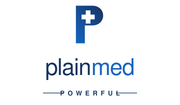

<div align="center">

<!-- GitHub swaps these on its light/dark theme. The navy wordmark is
     unreadable on a dark ground, hence the second variant. -->
<picture>
  <source media="(prefers-color-scheme: dark)" srcset="docs/assets/logo-dark.svg">
  <source media="(prefers-color-scheme: light)" srcset="docs/assets/logo.svg">
  
</picture>

### Clear reports. Private by design.

</div>

PlainMed turns blood-test reports into plain-language, source-linked
explanations. Photograph a report on your phone and get back an explanation
where every sentence points at the line that supports it. When the report does
not provide an answer, PlainMed says so explicitly.

Two deployment modes share one validated core:

- **Local** — everything on your own device, no network at all.
- **Cloud** — camera scanning and MedGemma on an NVIDIA GPU. Reports are
  processed in memory and never stored; see [deploy/README.md](deploy/README.md).

<p>
  
  
  
  
</p>

> ### ⚠️ Read this before you use or deploy this
>
> **PlainMed is a research prototype. It is not a medical device, it is not
> clinically validated, and no clinician has reviewed its glossary.**
>
> It explains what a report *says*. It does not diagnose, does not recommend
> treatment, and is not a substitute for a qualified clinician.
>
> **Do not deploy this to real patients** without reading
> [legal/README.md](legal/README.md), which lists the substantial gap
> between working software and a lawful service — signed data-processing
> agreements, a regulatory classification opinion, and clinical review of
> every word the system asserts in its own voice.
>
> Use the synthetic reports in [`samples/`](samples/) for development. Never
> commit real patient data to a fork of this repository.

## Quickstart

Activate the virtual environment first — Windows: `.venv\Scripts\activate`,
macOS/Linux: `source .venv/bin/activate`.

```bash
pip install -e ".[dev]"          # once, and after any dependency change
python -m pytest                 # 132 tests, ~4s
python scripts/demo.py           # 5-act demo, ~7s, no network needed
python -m uvicorn plainmed.api.app:app --app-dir src --port 8000
```

Then open <http://127.0.0.1:8000> and scan `samples/report_photo.png`.

**Verify the safety claims** (these drive the real app and check it from the outside):

```bash
python scripts/offline_check.py     # runs with every socket blocked
python scripts/retention_check.py   # writes nothing to disk or logs
python scripts/deident_check.py     # no identifier reaches the model
```

Port already in use? Add `--port 8010`. Import errors after a `git pull`?
Re-run the `pip install -e ".[dev]"` line.

## What it does (v1 scope)

- **Input**: pasted English blood-test text, or a text-based PDF (scanned PDFs
  are rejected with a clear message).
- **Extraction review**: shows every value, unit, reference range, and report
  flag it read — you confirm before anything is explained.
- **Plain-language explanations**: cards beside the original findings, each with
  source references (`S1`, `S2`, …) back to the exact report line.
- **A strict distinction** in the interface:
  - *"Your report says…"* — supported by the uploaded document.
  - *"What this term means…"* — from a small, locally stored, reviewed glossary
    (~40 common blood tests). A report may name a test without defining it;
    PlainMed never pretends the report supports an added explanation.
- **Questions for the clinician**, generated from flagged values, missing
  ranges, and terms the glossary cannot explain.
- **Understanding check**: two short questions grounded in the report itself.
- **Clear session**: removes the report and all results from the session.

Left out of v1 by design: scanned images/OCR, voice, multiple languages,
diagnosis, medication recommendations, hospital integrations, accounts.

## Architecture

```
app/mobile/                   camera-first web app (PWA, no build step)
app/streamlit_app.py          original desktop UI (optional extra)
src/plainmed/
  ingest/                     text, text-based PDF (pypdf), and camera intake
  ocr/                        photo -> positioned words -> report lines
    layout.py                   geometry-aware line reconstruction
    rapid.py / paddle.py        ONNX (CPU/dev) and Paddle (GPU/prod) engines
  extract/lab_parser.py       deterministic value/unit/range/flag extraction
                              with stable source-span IDs
  glossary/                   local reviewed glossary (JSON, versioned in git)
  llm/                        narrative backends behind one interface:
    deterministic.py            template-based, always available (default)
    medgemma.py                 optional local MedGemma inference
  pipeline/
    explain.py                  builds report / glossary / gap cards
    validate.py                 citation, number, and forbidden-claim checks
    questions.py                clinician questions + understanding check
    engine.py                   orchestration and model fallback
    routes.py                   scan (photo/pdf/text) then explain
    retention.py                PHI log filter, no-store headers
    runtime.py                  warm OCR + model engines
  deident.py                  removes identifiers before the model tier
  api/                        FastAPI service
    security.py                 consent gate, anonymous sessions, rate limit, audit
deploy/                       Dockerfile, compose, tiering, cost model
legal/                        compliance pack (drafts for counsel)
scripts/
  download_model.py           explicit, one-time model download (setup only)
  offline_check.py            runs the whole pipeline with sockets blocked
  retention_check.py          proves a request writes nothing and logs no PHI
samples/                      5 synthetic reports (no real patient data)
tests/                        pytest suite (parser, OCR layout, API, validation)
```

### The camera path

A photo is the riskiest input PlainMed accepts, so two things guard it:

- **Geometry, not reading order.** OCR returns positioned boxes; naive
  left-to-right joining scrambles lab tables and can pair one row's value with
  the next row's reference range — an error everything downstream would then
  validate as correct. `ocr/layout.py` groups boxes into rows by vertical
  overlap and preserves column gaps.
- **Confidence on the digits.** A value whose *numeric* tokens scored low is
  flagged for confirmation on the review screen. Scoring whole lines flagged
  every row on real input, and a warning that always fires is one nobody
  reads. Each OCR engine declares its own threshold, because confidence scales
  are not comparable across engines.

Nothing is explained until the user has seen and confirmed what was read. A
correction updates the source line too — a span is only ever PlainMed's best
*reading* of the report, never ground truth about the paper.

### The trust boundary

The GPU never receives identifiable data. Before anything reaches the model,
the report is reduced to reconstructed lab values — `Glucose 108 mg/dL (ref
70-99) [H]` — by an **allowlist**, not a scrubber: the text is rebuilt from
parsed fields, so a line that could hold a patient name never parsed into a
value and is withheld rather than filtered.

This is why a commodity GPU is usable. The tier that is expensive to comply
with (handles PHI) is cheap to run (CPU); the tier that is expensive to run
(GPU) has no compliance burden. `scripts/deident_check.py` holds the
boundary in CI against 14 identifier categories. See
[deploy/ARCHITECTURE.md](deploy/ARCHITECTURE.md).

### One deliberate change from the original plan

The original plan made MedGemma the core of the pipeline. In this version the
**deterministic engine is the core** and the model is an optional enhancement:

- Extraction, findings cards, gap detection, clinician questions, and the
  understanding check are fully deterministic and testable.
- The narrative summary comes from a pluggable backend. With MedGemma installed
  it is used; otherwise (no GPU, no weights, or failed validation) PlainMed
  falls back to a template-based summary and says which backend produced it.
- **Everything shown to the user passes the same validator**, regardless of
  which backend produced it: cited passages must exist, every number must
  appear in the cited passage (compared as decimals), and diagnostic /
  treatment / reassurance claims are rejected unless the report itself says
  them. Failed statements are removed and reported, never silently shown.

This means the app is useful and safe on any machine, and the model can only
add fluency — never facts.

### Threat model notes

- Report text is untrusted data. It is HTML-escaped in the UI, passed to the
  model inside delimited data markers, and instructions embedded in a report
  cannot change application behavior (covered by a test).
- Model output is untrusted until validated (schema parse → citation check →
  number check → forbidden-claim check).

## Setup

Requires Python 3.10+.

```bash
pip install -e ".[dev]"
```

That installs the API, the mobile app, and CPU OCR. Add `".[desktop]"` for the
Streamlit UI, or `".[gpu]"` for MedGemma and GPU OCR.

Run the tests and the offline check:

```bash
python -m pytest
```

```bash
python scripts/offline_check.py
```

```bash
python scripts/retention_check.py
```

```bash
python scripts/deident_check.py
```

### Optional: local MedGemma

Only needed if you want model-generated narrative; requires a CUDA GPU
(memory needs depend on precision and context length).

```bash
pip install -e ".[llm]" huggingface_hub
```

MedGemma (`google/medgemma-1.5-4b-it`) is a gated model under Google's Health
AI Developer Foundations terms — separate from this application's license.
Accept the terms on Hugging Face, run `hf auth login`, then:

```bash
python scripts/download_model.py
```

Weights land in `models/` (git-ignored). After that you can disconnect from
the network; the app loads them with `local_files_only=True` and forces
`HF_HUB_OFFLINE=1` before transformers is imported.

Backend selection via `PLAINMED_BACKEND`: `auto` (default), `deterministic`,
or `medgemma`.

## Run

The mobile app and API:

```bash
python -m uvicorn plainmed.api.app:app --app-dir src --port 8000
```

Open http://127.0.0.1:8000 — on a phone, "Add to Home Screen" installs it.
Interactive API docs are at `/api/docs`.

The original desktop UI (needs the `desktop` extra):

```bash
python -m streamlit run app/streamlit_app.py
```

The bundled `.streamlit/config.toml` binds to `127.0.0.1` and disables usage
statistics. Reports live only in session memory — no database, no files, no
logs of report content. **Demo: disconnect the internet, then understand the
report.**

## Offline and privacy guarantees

| Claim | How it is enforced |
|---|---|
| No inference calls leave the device | Model loaded from local files only; `HF_HUB_OFFLINE`/`TRANSFORMERS_OFFLINE` forced in-process |
| No telemetry | `gatherUsageStats = false`; no analytics, no external fonts/assets |
| Local access only | Server bound to `127.0.0.1` |
| No report persistence | Session memory only; "Clear session" wipes it; report text never logged |
| Verified, not assumed | `scripts/offline_check.py` blocks socket creation and runs all samples end-to-end |

For the cloud deployment the guarantee is different — "processed, never
stored" rather than "never transmitted":

| Claim | How it is enforced |
|---|---|
| Reports never written to disk | No file writes in the request path; `retention_check.py` fails if any file appears |
| Reports never logged | PHI log filter on the root logger; handlers record counts, not content |
| No browser or proxy caching | `no-store` on every response |
| Not claimed | Memory scrubbing, host hardening, or protection from an infrastructure compromise |

Offline processing reduces transmission risk; it does not by itself secure the
device or guarantee memory is scrubbed.

## Evaluation

`python scripts/offline_check.py` reports, per synthetic sample: values
extracted, cards produced, summary items, backend used, and validation errors.
The test suite additionally covers numerical/unit preservation, rejection of
unsupported statements and forbidden claims, missing-reference-range handling,
prompt-injection resistance, and determinism of results.

Synthetic tests demonstrate engineering behavior — not clinical safety or
improved patient outcomes. All sample data is synthetic.

## Known limitations

- English, tabular blood-test formats only; unusual layouts fall into the
  "could not read" list (surfaced, never silently dropped).
- Scanned PDFs are rejected (no OCR in v1).
- The glossary covers ~40 common analytes; anything else is explicitly marked
  as unexplained.
- MedGemma output quality is not clinically validated; that is why every
  statement is validated structurally and the deterministic path exists.

## Contributing

Contributions are welcome — see [CONTRIBUTING.md](CONTRIBUTING.md). It
documents four rules that are not negotiable (numbers never come from the
model; nothing is explained before a human confirms it; no identifier
reaches the model tier; nothing is written to disk or logs) and explains
which files are regulatory controls rather than ordinary code.

**The most valuable contribution available is not code.** The 40-term
glossary has never been reviewed by a clinician. If you are qualified to do
that, please open an issue.

Translations are also welcome, with the same caveat the code carries: a
consent notice must be reviewed by a qualified translator before it reaches
a patient.

## Security

Please report vulnerabilities privately — see [SECURITY.md](SECURITY.md).
Do not open a public issue for a security problem, and never use real
patient data when testing.

## License

Application code is Apache-2.0 — see [LICENSE](LICENSE).

**MedGemma model weights are not covered by that licence and are not
distributed here.** They are governed by Google's Health AI Developer
Foundations terms, which you must accept separately before downloading them
with `scripts/download_model.py`.

## Acknowledgements

Built on [MedGemma](https://developers.google.com/health-ai-developer-foundations/medgemma)
by Google, served with [NVIDIA TensorRT-LLM / NIM](https://developer.nvidia.com/tensorrt-llm),
with OCR by [RapidOCR](https://github.com/RapidAI/RapidOCR) and
[PaddleOCR](https://github.com/PaddlePaddle/PaddleOCR).
